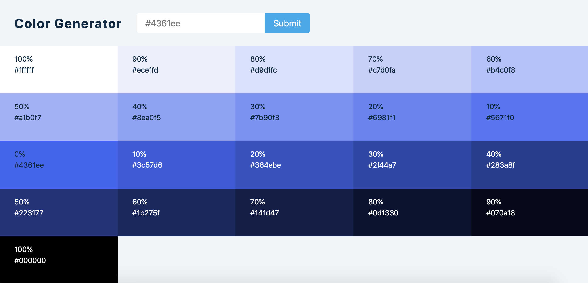

# Color Generator App

A simple Color Generator app that generates tints & shades of any given color. Built with React.

## My process

### Built with

- Semantic HTML5 markup
- CSS custom properties
- CSS Grid & Flexbox
- React.js ⚛️

### What I learned

This is my first React project where I worked with HTML forms. Learned a lot about controlled inputs. Most of the logic was pretty similar with useState & useEffect.

In this project, I also worked with Values.js library to generate tints & shades of our base color.

### Demo

- [Demo](https://webster-color-generator.netlify.app/)

### Screenshot:

#### Values JS

[Values.js](https://github.com/noeldelgado/values.js)

#### Flaticon

[Flaticon](https://www.flaticon.com/free-icons/color-wheel)
